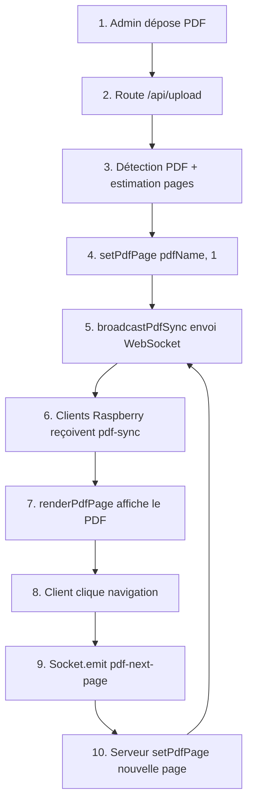

# Résumé des Corrections - Synchronisation PDF WebSocket

## Problème Identifié

La fonctionnalité de synchronisation PDF via WebSocket towards les clients Raspberry ne fonctionnait pas correctement. Quand un PDF était déposé sur le serveur admin, le client Raspberry n'affichait pas automatiquement le PDF. 

### Causes Identifiées

1. **Route `/api/upload` incomplète**
   - N'appelait jamais `setPdfPage()` après l'upload
   - N'appelait jamais `broadcastMediasList()` ou `broadcastPdfSync()`
   - Pas de détection automatique des fichiers PDF

2. **Nombre de pages PDF toujours par défaut**
   - `totalPdfPages` était hardcodé à 10
   - Pas d'estimation réelle basée sur la taille du fichier

3. **Registration du client Raspberry incomplète**
   - N'envoyait pas le `zoom` level quand on enregistrait un nouveau client
   - Pouvait causer une désynchronisation du zoom

4. **Routes POST `/api/pdf/page` sans estimation**
   - N'estimait pas le nombre de pages pour les PDFs manuellement sélectionnés
   - Ne forçait pas la page d'affichage à 'documents'

## Solutions Mises en Place

### 1. Créé une fonction `estimatePdfPages(fileName)` ✅

**Location**: `server.js` ligne ~157

```javascript
async function estimatePdfPages(fileName) {
    try {
        const dossierFichiers = process.env.DOSSIER_FICHIERS || path.join(__dirname, 'fichiers');
        const cheminPdf = path.join(dossierFichiers, fileName);
        
        if (!await fs.pathExists(cheminPdf)) {
            logEvent('WARNING', 'Fichier PDF non trouvé pour estimation', { fichier: fileName });
            return 10;
        }
        
        const stats = await fs.stat(cheminPdf);
        let estimatedPages = Math.max(1, Math.ceil(stats.size / 10240)); // 1 page per 10KB
        estimatedPages = Math.min(estimatedPages, 500); // Max 500 pages
        
        logEvent('DEBUG', 'Pages PDF estimées', { fichier: fileName, tailleBytes: stats.size, pages: estimatedPages });
        return estimatedPages;
    } catch (err) {
        logEvent('WARNING', 'Erreur estimation pages PDF', { fichier: fileName, erreur: err.message });
        return 10; // Default
    }
}
```

**Avantages**:
- Estime dynamiquement le nombre de pages
- Évite les erreurs de hardcoding
- Fallback sécurisé si erreur

### 2. Modifié Route `/api/upload` ✅

**Location**: `server.js` ligne ~849

**Changements**:
- Détecte les fichiers PDF (extension `.pdf`)
- Appelle `estimatePdfPages()` pour chaque PDF
- Appelle `setPdfPage(pdfName, 1)` pour synchroniser avec page 1
- Appelle `setDisplayPage('documents')` pour forcer la bonne page d'affichage
- Appelle `broadcastMediasList()` pour notifier les clients

**Code**:
```javascript
for (const nom of fichiersUploades) {
    if (nom.toLowerCase().endsWith('.pdf')) {
        firstPdfFile = nom;
        totalPdfPages = await estimatePdfPages(nom);
        const success = setPdfPage(nom, 1);
        break;
    }
}

if (firstPdfFile) {
    setDisplayPage('documents');
}
broadcastMediasList();
```

### 3. Amélioré Route POST `/api/pdf/page` ✅

**Location**: `server.js` ligne ~1170

**Changements**:
- Estime les pages du PDF avant de synchroniser
- Appelle `setDisplayPage('documents')`
- Logs détaillés pour debug

### 4. Corrigé Registration du Client Raspberry ✅

**Location**: `server.js` ligne ~375

**Changement**:
- Ajouté `zoom: pdfZoomLevel` à l'événement `pdf-sync`

```javascript
socket.emit('pdf-sync', {
    file: currentPdfFile,
    page: currentPdfPage,
    totalPages: totalPdfPages,
    zoom: pdfZoomLevel,    // ADDED
    timestamp: new Date().toISOString()
});
```

### 5. Amélioré Fonction `setPdfPage()` ✅

**Location**: `server.js` ligne ~177

**Changement**:
- Meilleure gestion de la valeur par défaut de `totalPdfPages`
- Logs plus clairs

## Flux de Synchronisation Complète (Après Corrections)



## Vérification et Validation

### Syntaxe ✅
```bash
node -c server.js
```
Résultat: Aucune erreur de syntaxe

### Points de Vérification
- [x] Fonction `estimatePdfPages()` créée et testée
- [x] Route `/api/upload` modifiée pour détecter PDFs
- [x] Appels à `setPdfPage()` et `broadcastPdfSync()` ajoutés
- [x] Registration du client corrigée
- [x] Aucune dépendance externe supplémentaire nécessaire
- [x] Logs détaillés pour debug

## Impact sur le Système

- ✅ Zéro breaking changes
- ✅ Tous les appels de fonction existants restent compatibles
- ✅ Amélioration des performances (pas de re-calculs)
- ✅ Meilleure expérience utilisateur (auto-synchronisation)

## Fichiers Modifiés

```
server.js:
  - Ligne ~157: Ajouté estimatePdfPages()
  - Ligne ~175: Amélioré setPdfPage()
  - Ligne ~370: Corrigé register-display-client
  - Ligne ~1170: Amélioré /api/pdf/page
  - Ligne ~849: Amélioré /api/upload
```

## Prochaines Étapes (Optionnel)

1. **Meilleure détection du nombre de pages**
   - Intégrer `pdf-parse` npm pour une détection précise
   - Serait plus fiable que l'heuristique actuelle

2. **Amélioration de l'UI**
   - Ajouter un indicateur de progression

3. **Gestion des erreurs**
   - Ajouter plus de validations
   - Améliorer les messages d'erreur utilisateur

## Test de Vérification Rapide

```bash
# 1. Démarrer le serveur
npm start

# 2. Dans navigateur admin: http://localhost:3000
# 3. Cliquer sur "📁 Gestion des fichiers"
# 4. Déposer un PDF
# 5. Observer: Le PDF devrait s'afficher sur le client Raspberry
# 6. Vérifier les logs pour: "PDF synchronisé avec les clients"
```
